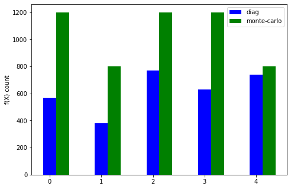

# diagonal-go
An approach to parallelize diagonal global optimization method for Lipschitz function with unknown constant

# Сравнение на двуменых функциях с методом Монте-Карло

Функции взяты из книжки со страницы 191 под номерами: 1, 11, 9, 10, 3

